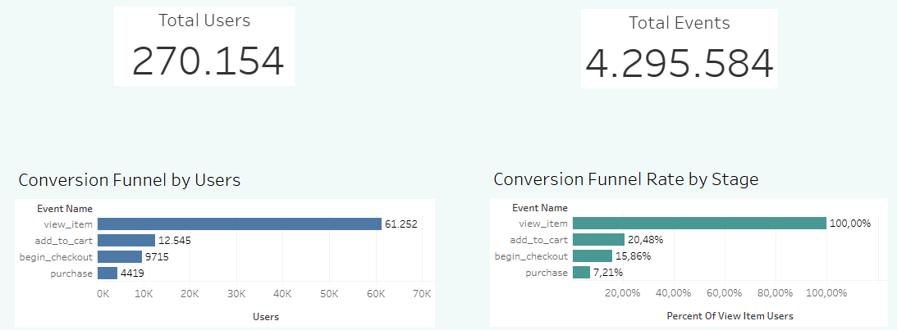
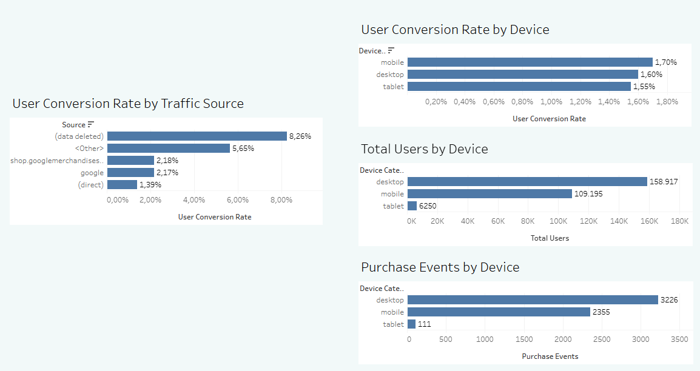
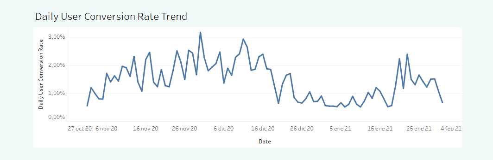
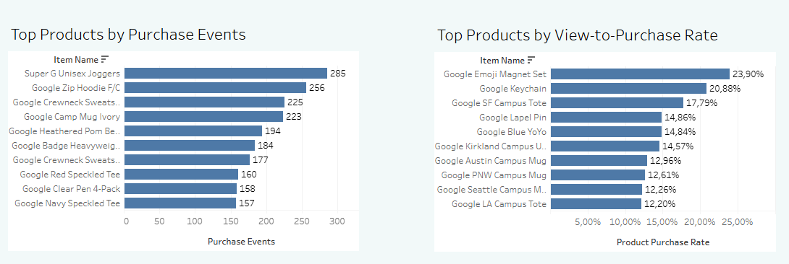

# GA4 E-Commerce Marketing Performance Analysis

This project analyzes Google Analytics 4 (GA4) e-commerce data from the Google Merchandise Store to better understand user behavior, conversion rates, device performance, traffic sources, and product performance.

SQL and Tableau were used to identify which devices and traffic sources had stronger conversion rates, where users dropped off in the conversion funnel, and which products performed best based on purchase activity.

## Tools Used

- BigQuery SQL
- Tableau Public
- Google Analytics 4 (GA4) sample e-commerce dataset

## Business Questions

- How many users and events were in the dataset?
- Where did users drop off in the conversion funnel?
- Which traffic sources had the highest conversion rates?
- Which device category had the highest conversion rate?
- How did the conversion rate change over time?
- Which products generated the most purchases?
- Which products had the highest view-to-purchase rate?

## Analysis

BigQuery SQL was used to explore the dataset and calculate the metrics needed for the Tableau dashboard.

The analysis included:

- Total users and total events
- Conversion funnel performance
- Funnel-stage conversion rates
- User conversion rate by traffic source
- User conversion rate by device
- Daily conversion-rate trends
- Top products by purchase events
- Product view-to-purchase rates

The conversion funnel tracked users from viewing a product to adding an item to the cart, beginning checkout, and completing a purchase.

User conversion rate was calculated as:

`purchasing users / total users × 100`

Funnel-stage rate was calculated as:

`users at each funnel stage / view_item users × 100`

After the SQL analysis was completed, the results were exported as CSV files and imported into Tableau Public to build the final dashboard.

## Key Findings

- The dataset included 270,154 total users and 4,295,584 total events.
- The conversion funnel showed the largest drop-off between product views and add-to-cart. Of 61,252 product viewers, 12,545 added an item to cart, 9,719 began checkout, and 4,419 completed a purchase.
- In percentage terms, 20.48% of product viewers added an item to cart, 15.86% began checkout, and 7.21% completed a purchase.
- Mobile had the highest user conversion rate at 1.70%, followed by desktop at 1.60% and tablet at 1.55%.
- Desktop generated the most total purchase activity because it had the largest user base, even though mobile converted slightly more efficiently.
- Traffic-source performance varied across channels. Google and shop.googlemerchandisestore had similar conversion rates, while direct traffic had the lowest conversion rate among the named sources.
- The highest overall traffic-source conversion rate came from an anonymized “data deleted” source, so that result should be interpreted cautiously.
- Daily conversion performance fluctuated over time, with the strongest spikes appearing around late November and mid-December, which may reflect Cyber Monday and holiday-season shopping behavior.
- Super G Unisex Joggers generated the most purchase events, followed by Google Zip Hoodie F/C.
- Smaller items such as the Google Emoji Magnet Set, Google Keychain, and Google SF Campus Tote had the highest view-to-purchase rates.
- The products with the highest purchase volume were not always the same products with the strongest conversion efficiency.

## Dashboard

The dashboard summarizes user behavior, conversion performance, traffic sources, device performance, product performance, and daily trends.

## Project Goal

The goal of this project was to turn raw GA4 e-commerce event data into actionable business insights using SQL and Tableau.

The analysis helped identify where users dropped off in the purchasing journey, which devices and traffic sources converted more efficiently, and which products performed strongest by purchase activity and conversion efficiency.
